# Лабораторная работа №2
## Логирование, мониторинг и визуализация

**Дисциплина:** Коммуникационные сервисы  
**Факультет:** Программной инженерии и компьютерной техники  
**Университет:** ИТМО

**Студент:** Тутубалин Кирилл, Москалец Данила, Захматов Юрий, Джафари Хоссаин, Мохаджер Али Реза  
**Группа:** К3340-К3341  
**Преподаватель:** Самохин Никита Юрьевич  

**Санкт-Петербург, 2025 г.**

---

## 1. Цель работы

Изучить на практике построение системы логирования, мониторинга и визуализации состояния веб‑сервиса на примере стека технологий:
- **Nextcloud** - тестовое веб‑приложение для генерации логов;
- **Loki + Promtail** - система централизованного сбора и хранения логов;
- **Zabbix** - система мониторинга доступности и состояния сервиса;
- **Grafana** - платформа для визуализации логов и метрик.

---

## 2. Используемое программное обеспечение

- **Docker** и **Docker Compose** - для контейнеризации и оркестрации сервисов
- **Nextcloud** (`nextcloud:29.0.6`) - облачное хранилище файлов
- **Grafana Loki** (`grafana/loki:2.9.0`) - система агрегации логов
- **Promtail** (`grafana/promtail:2.9.0`) - агент сбора логов
- **Grafana** (`grafana/grafana:11.2.0`) - платформа визуализации
- **PostgreSQL 15** - база данных для Zabbix
- **Zabbix Server** (`zabbix/zabbix-server-pgsql:ubuntu-6.4-latest`) - сервер мониторинга
- **Zabbix Web** (`zabbix/zabbix-web-nginx-pgsql:ubuntu-6.4-latest`) - веб‑интерфейс Zabbix

---

## 3. Ход работы

### 3.1. Подготовка окружения

#### 3.1.1. Подключение к удалённому серверу

Выполнено подключение к удалённой машине по протоколу SSH для развёртывания лабораторного стенда.

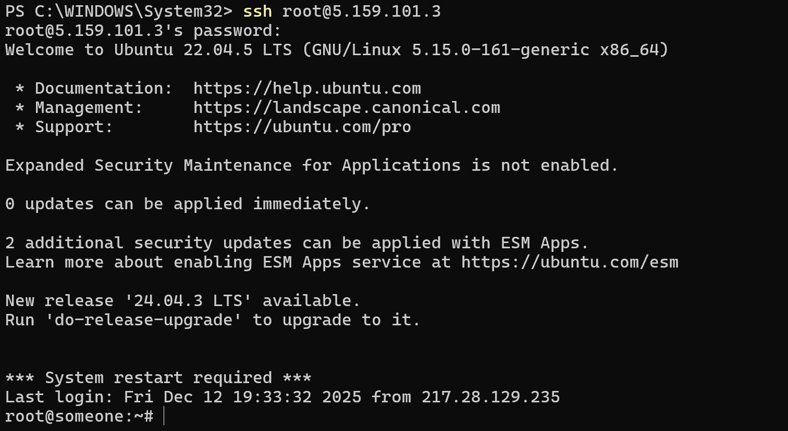

*Рисунок 1 - Подключение к удалённому серверу по SSH*

#### 3.1.2. Передача файлов на сервер

Через SCP/SSH были переданы файлы лабораторной работы, включая `docker-compose.yml`, `promtail_config.yml` и `template.yml`.

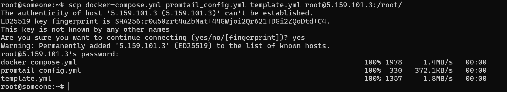

*Рисунок 2 - Передача файлов на удалённый сервер*

#### 3.1.3. Запуск Docker Compose

Выполнена команда `docker compose up -d` для запуска всех сервисов в фоновом режиме.

*Рисунок 3 - Запуск контейнеров через Docker Compose*

#### 3.1.4. Проверка статуса контейнеров

Командой `docker compose ps` проверено, что все контейнеры успешно запущены и работают:
- `nextcloud` - веб‑приложение
- `loki` - система хранения логов
- `promtail` - агент сбора логов
- `grafana` - платформа визуализации
- `postgres-zabbix` - база данных
- `zabbix-back` - сервер Zabbix
- `zabbix-front` - веб‑интерфейс Zabbix

*Рисунок 4 - Проверка статуса запущенных контейнеров*

#### 3.1.5. Настройка сетевых портов

Проверена доступность портов для доступа к сервисам:
- `8080` - Nextcloud
- `3000` - Grafana
- `3100` - Loki
- `8082` - Zabbix Web
- `10051` - Zabbix Server

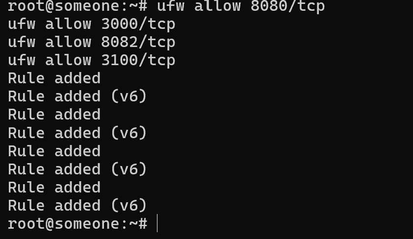

*Рисунок 5 - Проверка открытых портов*

---

### 3.2. Инициализация Nextcloud

#### 3.2.1. Мастер установки Nextcloud

В браузере открыт адрес `http://<host>:8080`, запущен мастер начальной настройки Nextcloud.

*Рисунок 6 - Мастер установки Nextcloud*

#### 3.2.2. Создание административного аккаунта

Создана учётная запись администратора с указанием логина и пароля. Выбрана встроенная база данных SQLite для упрощения настройки.

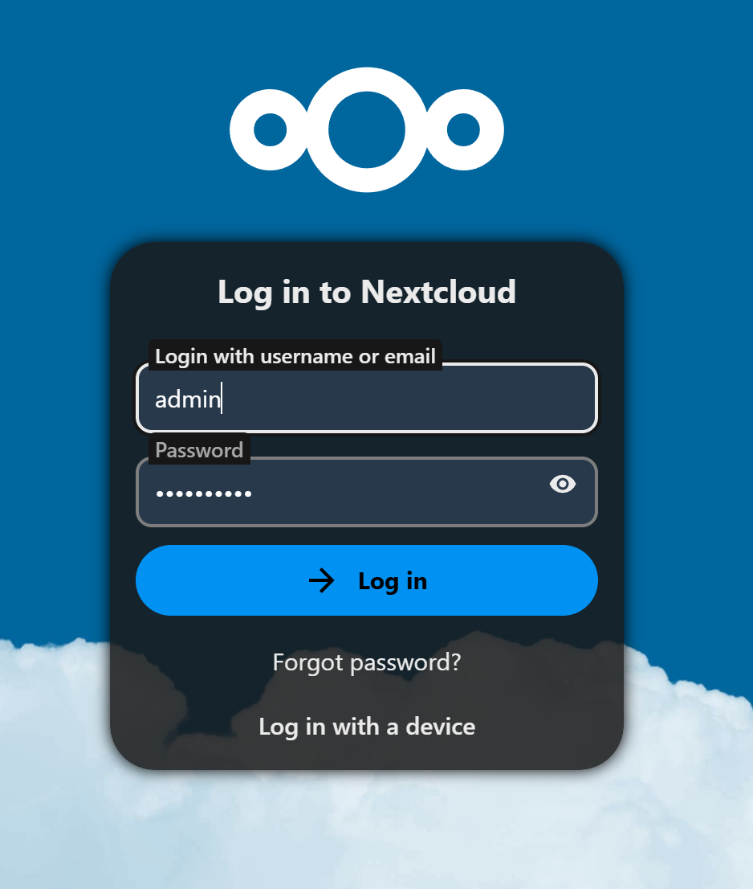

*Рисунок 7 - Создание административного аккаунта*

#### 3.2.3. Главная страница Nextcloud

После завершения установки открыта главная страница Nextcloud, подтверждена корректная работа сервиса.

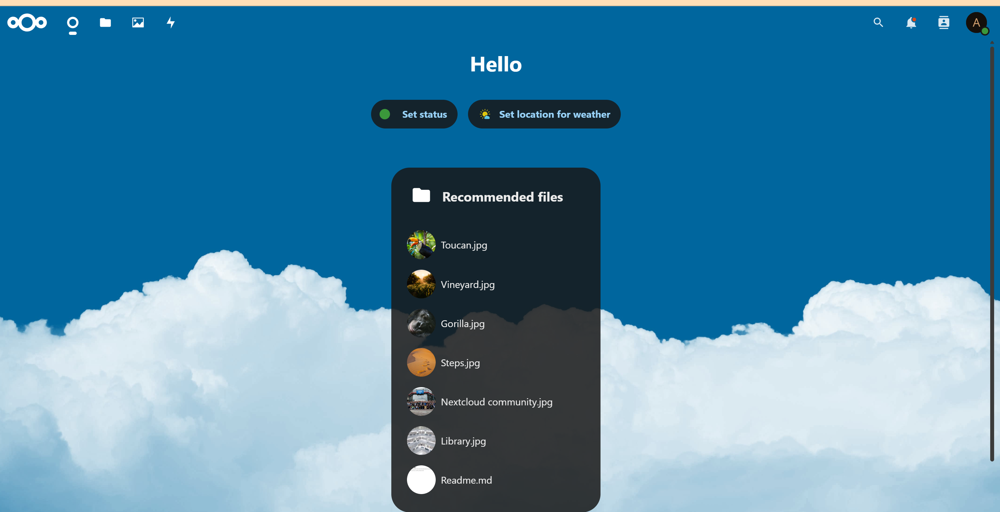

*Рисунок 8 - Главная страница Nextcloud после установки*

#### 3.2.4. Генерация логов

В веб‑интерфейсе Nextcloud выполнены действия пользователя (загрузка файлов, удаление, навигация), чтобы сгенерировать логи для последующего анализа.

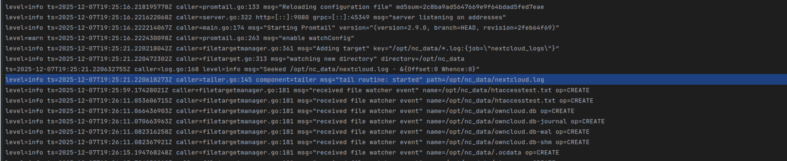

*Рисунок 9 - Работа с файлами в Nextcloud для генерации логов*

---

### 3.3. Настройка системы логирования (Promtail и Loki)

#### 3.3.1. Конфигурация Promtail

Настроен Promtail для сбора логов Nextcloud. В файле `promtail_config.yml` указаны:
- путь к лог‑файлам Nextcloud: `/opt/nc_data/*.log`
- адрес сервера Loki: `http://loki:3100/loki/api/v1/push`
- метки для идентификации логов: `job: nextcloud_logs`

*Рисунок 10 - Настройка Promtail для сбора логов*

#### 3.3.2. Проверка работы Loki

Проверено, что Loki успешно принимает логи от Promtail. Выполнена проверка доступности сервиса и статуса приёма данных.

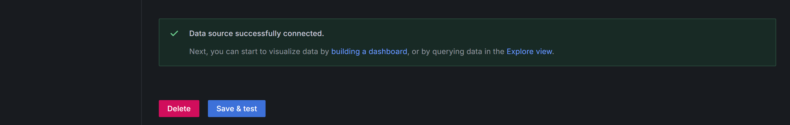

*Рисунок 11 - Проверка работы Loki*

#### 3.3.3. Просмотр логов в Grafana

В Grafana настроен источник данных Loki и выполнены запросы для просмотра логов Nextcloud. Логи отображаются в виде таблицы с возможностью фильтрации.

*Рисунок 12 - Просмотр логов Nextcloud в Grafana через Loki*

#### 3.3.4. PromQL запросы

Выполнены PromQL запросы через Query Builder в Grafana для анализа логов и создания метрик.

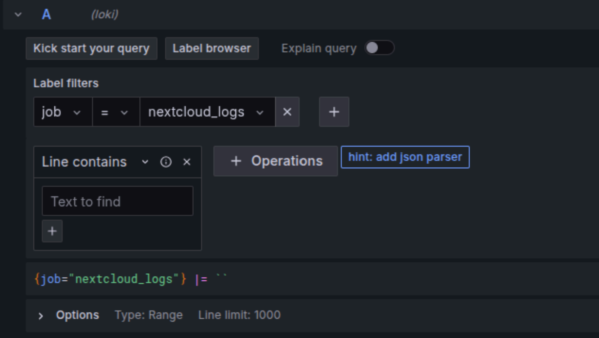

*Рисунок 13 - Создание PromQL запроса через Builder*

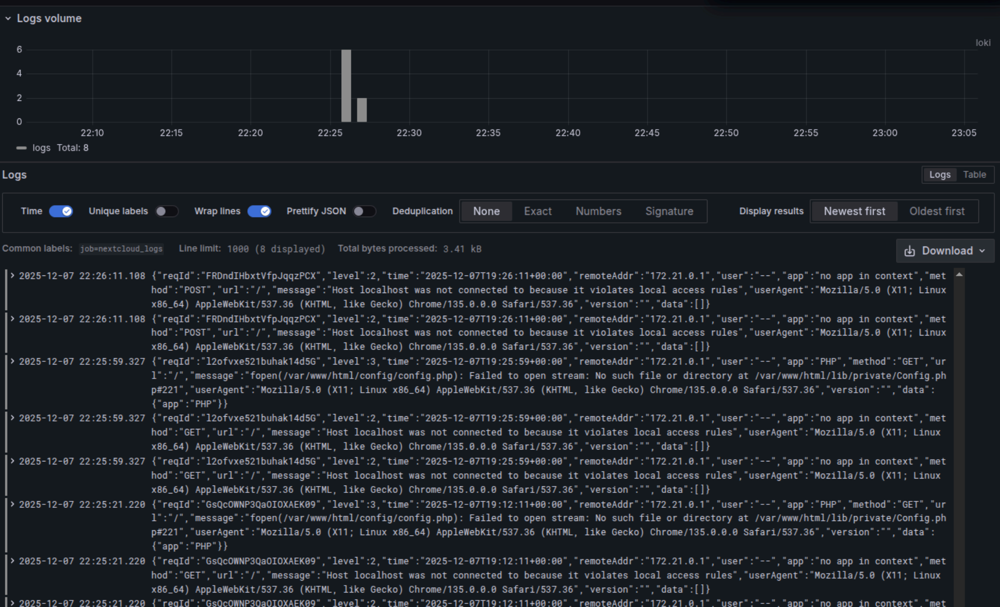

*Рисунок 14 - Результат выполнения PromQL запроса*

#### 3.3.5. Фильтрация логов

Настроены фильтры для поиска и анализа конкретных событий в логах Nextcloud.

*Рисунок 15 - Фильтрация логов в табличном виде*

---

### 3.4. Настройка мониторинга (Zabbix)

#### 3.4.1. Вход в веб‑интерфейс Zabbix

Открыт веб‑интерфейс Zabbix по адресу `http://<host>:8082` и выполнена авторизация с учётными данными по умолчанию (Admin/zabbix).

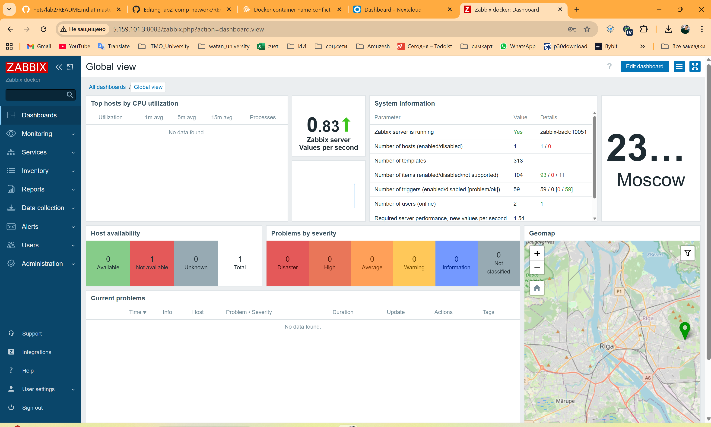

*Рисунок 16 - Авторизация в Zabbix Web UI*

#### 3.4.2. Импорт шаблона мониторинга

В разделе **Configuration -> Templates** выполнен импорт шаблона мониторинга Nextcloud из файла `template.yml`. Шаблон содержит:
- элемент данных типа HTTP Agent для проверки статуса через `status.php`
- триггер для обнаружения режима обслуживания (maintenance mode)

*Рисунок 17 - Раздел шаблонов в Zabbix*

*Рисунок 18 - Импорт шаблона мониторинга Nextcloud*

#### 3.4.3. Создание хоста для Nextcloud

В разделе **Configuration -> Hosts** создан новый хост для мониторинга Nextcloud с указанием IP‑адреса или доменного имени сервера.

*Рисунок 19 - Раздел управления хостами*

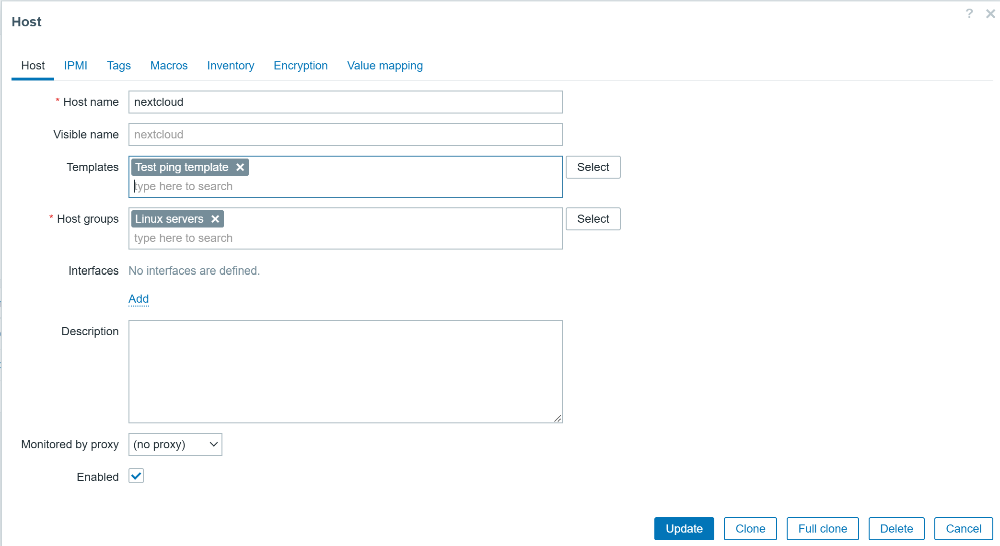

*Рисунок 20 - Создание нового хоста для Nextcloud*

#### 3.4.4. Применение шаблона к хосту

К созданному хосту применён импортированный шаблон `Test ping template`. Хост настроен и активен.

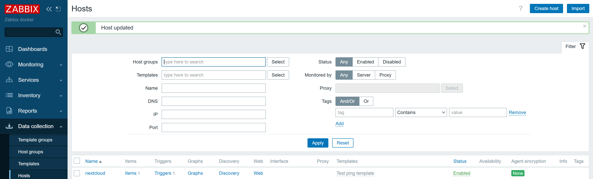

*Рисунок 21 - Настройка хоста с применением шаблона*

#### 3.4.5. Проверка данных мониторинга

В разделе **Monitoring -> Latest data** проверены собираемые данные по хосту Nextcloud. Элемент данных `nextcloud.ping` возвращает значение `healthy` или `unhealthy` в зависимости от статуса сервиса.

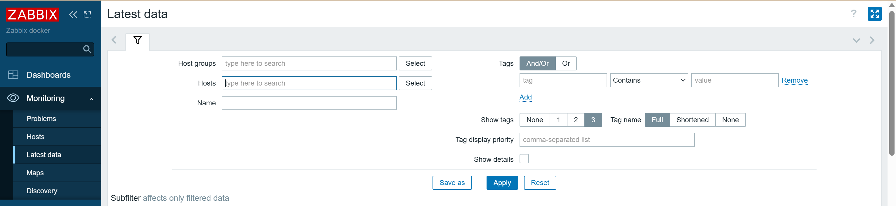

*Рисунок 22 - Просмотр последних данных по хосту*

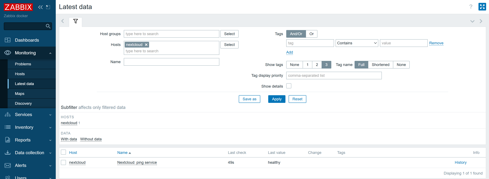

*Рисунок 23 - Данные мониторинга Nextcloud в Zabbix*

#### 3.4.6. Проверка работы триггеров

Проверено, что триггеры корректно срабатывают при изменении состояния сервиса. При включении режима обслуживания Nextcloud триггер переходит в состояние "Проблема".

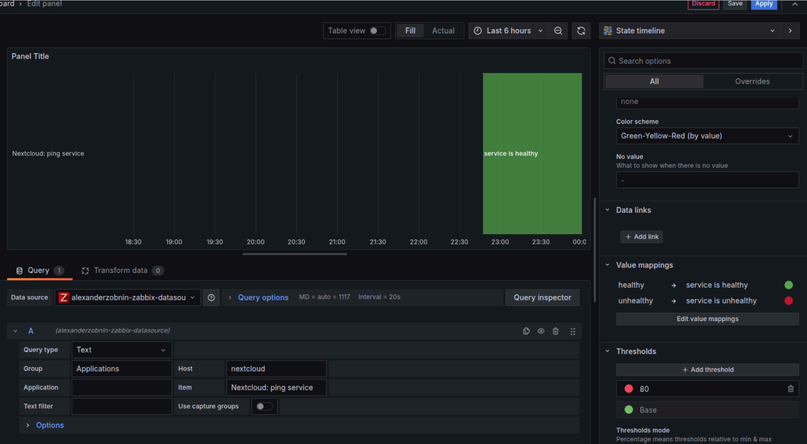

*Рисунок 24 - Статус сервера и триггеров в Zabbix*

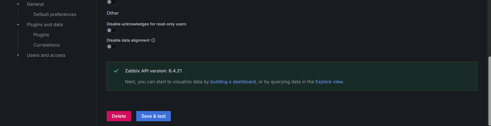

*Рисунок 25 - Успешная работа мониторинга Zabbix*

---

### 3.5. Визуализация в Grafana

#### 3.5.1. Вход в Grafana

Открыт веб‑интерфейс Grafana по адресу `http://<host>:3000` и выполнен вход в систему.

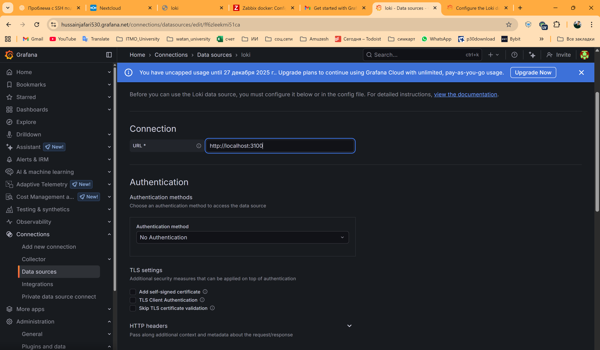

*Рисунок 26 - Веб‑интерфейс Grafana*

#### 3.5.2. Настройка источника данных Loki

В разделе **Configuration -> Data Sources** добавлен источник данных типа **Loki** с указанием URL `http://loki:3100`. Выполнен тест подключения.

*Рисунок 27 - Настройка источника данных Loki*

#### 3.5.3. Установка плагина Zabbix

В разделе **Configuration -> Plugins** установлен плагин **Zabbix** для интеграции Grafana с Zabbix.

#### 3.5.4. Настройка источника данных Zabbix

Добавлен источник данных типа **Zabbix** с указанием:
- URL API: `http://zabbix-front:8080/api_jsonrpc.php`
- учётные данные для подключения к Zabbix

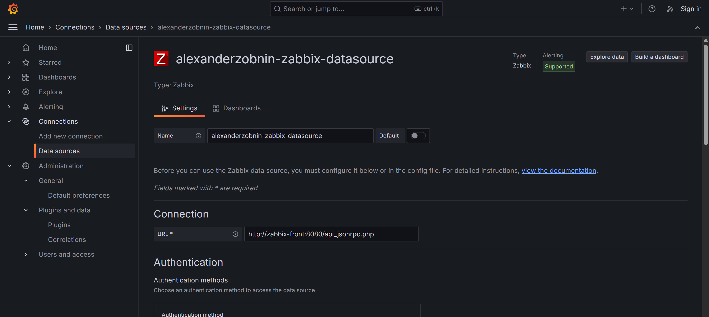

*Рисунок 28 - Настройка источника данных Zabbix*

#### 3.5.5. Создание дашборда с логами

Создан новый дашборд в Grafana с панелью типа **Logs** для отображения логов Nextcloud из Loki. Настроены запросы LogQL для фильтрации и анализа логов.

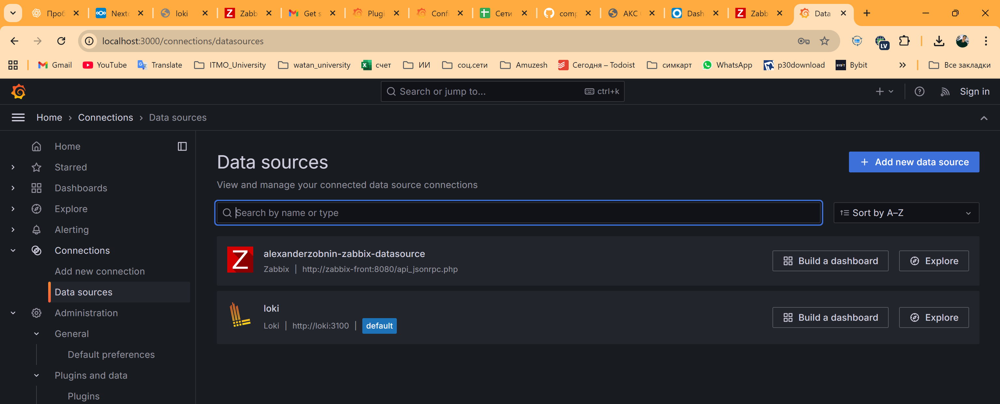

*Рисунок 29 - Дашборд с логами Nextcloud*

#### 3.5.6. Создание дашборда с метриками

Создан дашборд с панелями для отображения метрик из Zabbix:
- график доступности сервиса
- статус триггеров
- история изменений состояния

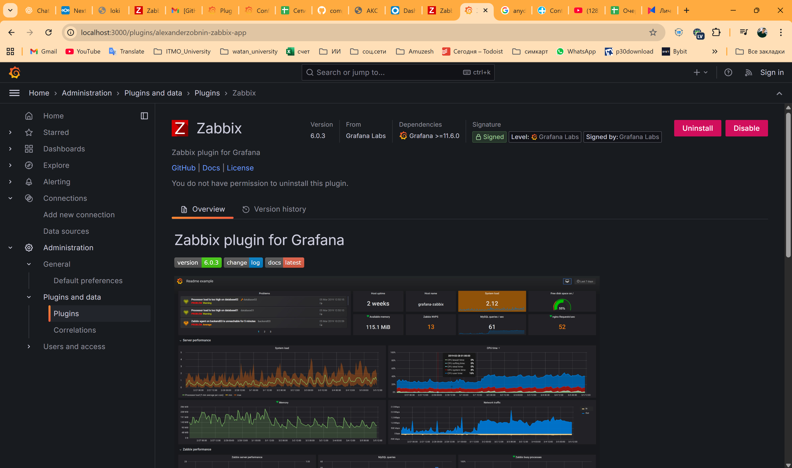

*Рисунок 30 - Дашборд с метриками из Zabbix*

*Рисунок 31 - Визуализация данных мониторинга*

#### 3.5.7. Комбинированный дашборд

Создан комбинированный дашборд, объединяющий логи из Loki и метрики из Zabbix для комплексного анализа состояния сервиса.

*Рисунок 32 - Комбинированный дашборд с логами и метриками*

---

## 4. Ответы на контрольные вопросы

### 4.1. Чем SLO отличается от SLA?

**SLA (Service Level Agreement)** - это юридическое соглашение между поставщиком услуг и клиентом, которое определяет условия предоставления услуги. Например, минимальный допустимый уровень доступности сервиса 99,9% времени. При нарушении договорённостей вводятся санкции, прописанные в договоре, например, возврат части средств.

**SLO (Service Level Objective)** - это целевые значения метрик, которые используются для внутреннего контроля работоспособности сервисов и услуг. Например, цель, к которой стремится команда разработки. SLO не является юридическим обязательством перед клиентом, а служит внутренним ориентиром для команды.

**Основное отличие:** SLA - это формальное соглашение с клиентом с юридическими последствиями, а SLO - внутренняя цель команды без юридических обязательств.

---

### 4.2. Чем отличается инкрементальный бэкап от дифференциального?

**Дифференциальный бэкап** - копируются все данные, изменённые с момента последнего полного бэкапа. Для восстановления потребуется полный бэкап и последний дифференциальный.

**Инкрементальный бэкап** - копируются все данные, изменённые с момента любого последнего бэкапа (полного или инкрементального). Для восстановления потребуется полный бэкап и все инкрементальные бэкапы по порядку.

**Основные отличия:**
- **Размер:** инкрементальные бэкапы обычно меньше по размеру
- **Скорость создания:** инкрементальные бэкапы создаются быстрее
- **Сложность восстановления:** для дифференциального нужны только полный и последний дифференциальный; для инкрементального - полный и вся цепочка инкрементальных
- **Время восстановления:** восстановление из дифференциального бэкапа быстрее

---

### 4.3. В чём разница между мониторингом и observability?

**Мониторинг (реактивный подход)** - отслеживание заранее известных метрик и состояний системы. Мониторинг отвечает на вопрос: "Всё ли в порядке?" и "Не вышло ли что‑то за порог?". Примеры: отслеживание CPU, RAM, ошибок, аптайма сервиса.

**Observability (наблюдаемость, проактивный подход)** - это способность понять внутреннее состояние сложной системы на основе доступных данных (логов, метрик, трассировок), даже если проблема ранее не была предсказана. Observability отвечает на вопрос: "Почему система ведёт себя именно так?".

**Основные отличия:**
- **Подход:** мониторинг - реактивный (реагирует на известные проблемы), observability - проактивный (позволяет исследовать неизвестные проблемы)
- **Объём данных:** мониторинг использует предопределённые метрики, observability опирается на логи, метрики и трассировки
- **Гибкость:** observability позволяет задавать новые вопросы о системе без предварительной настройки

---

## 5. Вывод

В ходе лабораторной работы был успешно развёрнут комплекс сервисов для логирования, мониторинга и визуализации состояния веб‑приложения Nextcloud с использованием Docker Compose.

**Достигнутые результаты:**

1. **Система логирования:** Настроен Promtail для автоматического сбора логов Nextcloud и отправки их в Loki. Логи успешно централизованы и доступны для анализа через Grafana.

2. **Система мониторинга:** Настроен Zabbix для мониторинга состояния Nextcloud через HTTP‑запросы к `status.php`. Реализован триггер, определяющий режим обслуживания сервиса.

3. **Визуализация:** В Grafana созданы дашборды, объединяющие логи из Loki и метрики из Zabbix, что обеспечивает наглядное представление о состоянии сервиса и позволяет оперативно выявлять и анализировать инциденты.

**Полученные навыки:**
- Работа с Docker Compose для оркестрации множественных сервисов
- Настройка системы централизованного логирования (Loki + Promtail)
- Конфигурация системы мониторинга (Zabbix) с использованием шаблонов и триггеров
- Создание дашбордов в Grafana для визуализации логов и метрик
- Использование PromQL и LogQL для запросов к данным

Лабораторная работа выполнена успешно. Все сервисы работают корректно, логи собираются, мониторинг функционирует, визуализация настроена.

---

**Приложения:**
- `docker-compose.yml` - конфигурация Docker Compose
- `promtail_config.yml` - конфигурация Promtail
- `template.yml` - шаблон мониторинга Zabbix
- Папка `./assets/` - скриншоты всех этапов работы

