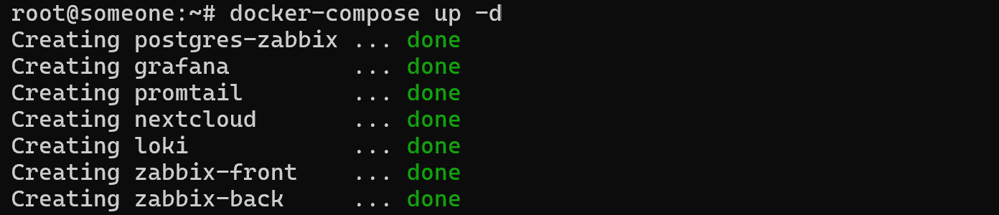
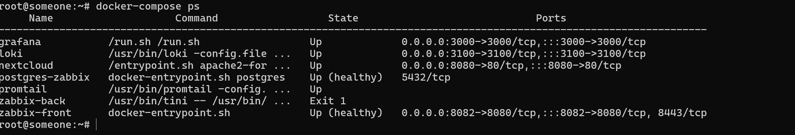
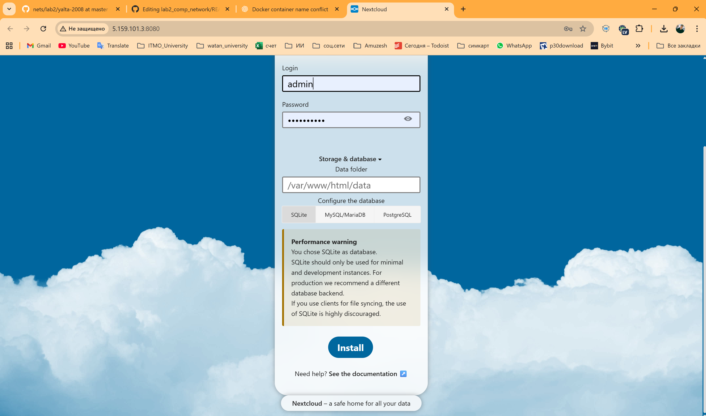
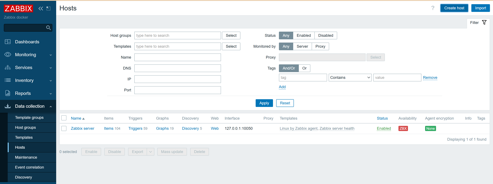
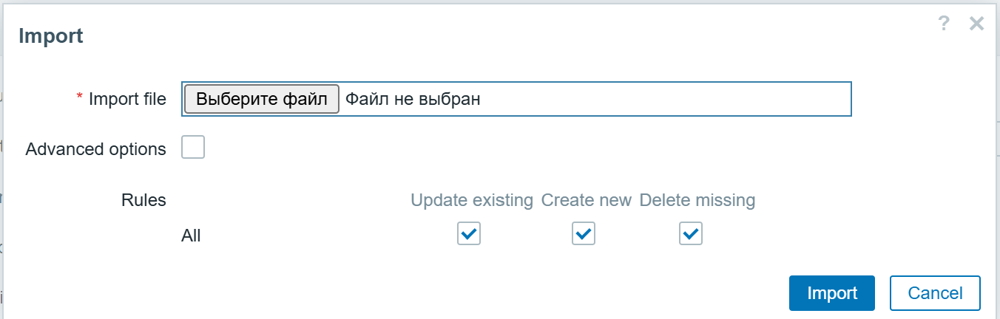
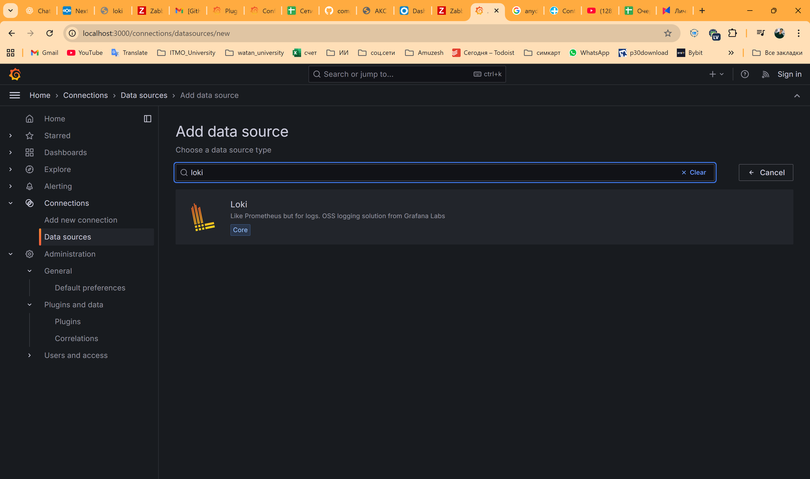
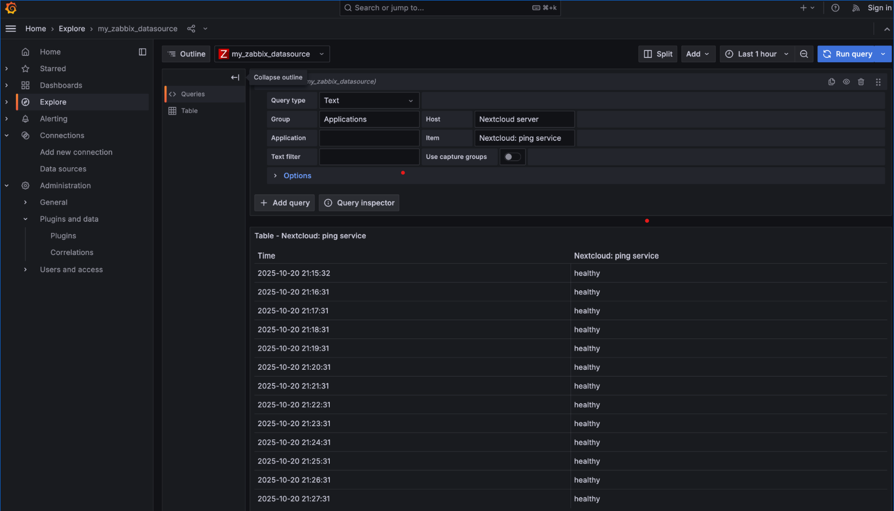
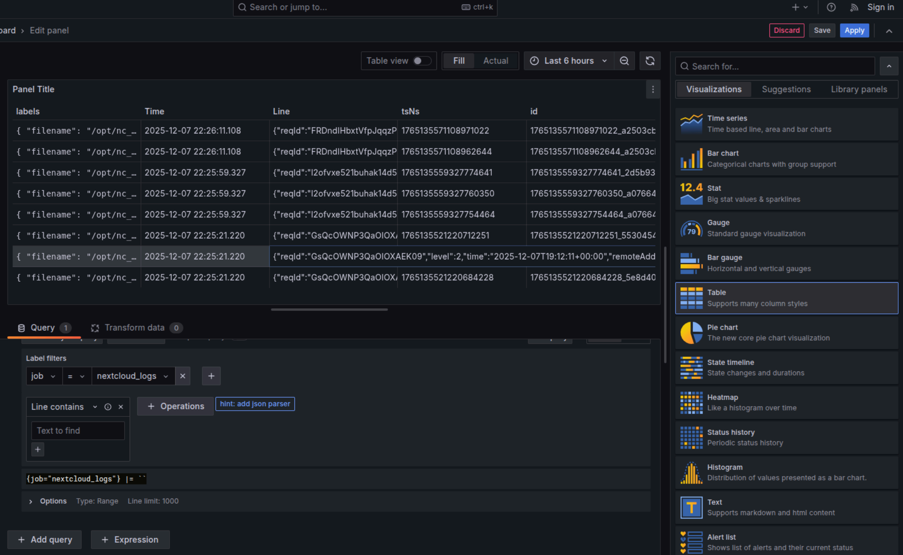
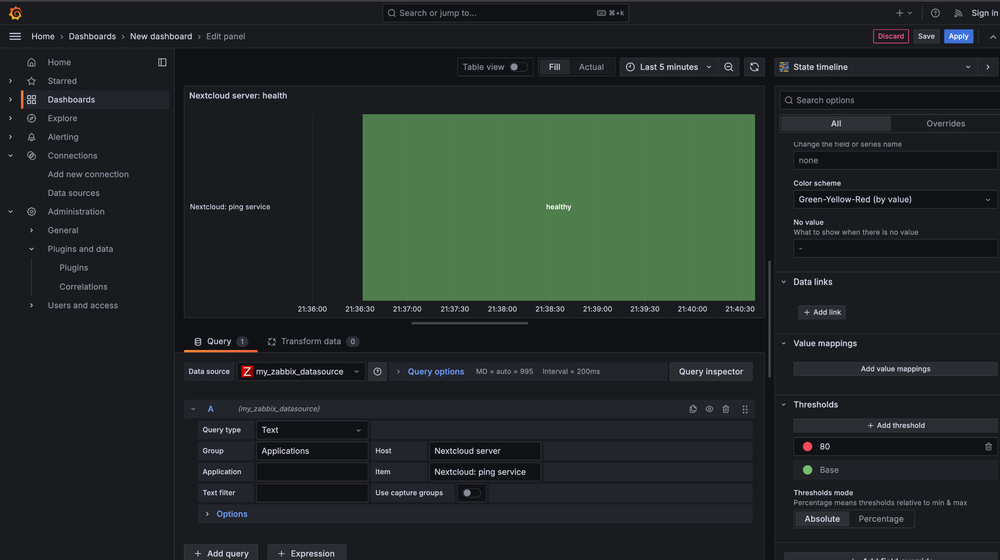

# Лабораторная работа №2

---

>>>>>>> 0c834a82d81f77ab2343b801ef25667fc5cf2a0c
## Логирование, мониторинг и визуализация

**Дисциплина:** Администрирование компьютерных сетей  
**Факультет:** Программной инженерии и компьютерной техники  
**Университет:** ИТМО  

**Студенты:** Тутубалин Кирилл, Москалец Данила, Захматов Юрий, Джафари Хоссаин, Мохаджер Али Реза  
**Группа:** К3340–К3341  
**Преподаватель:** Самохин Никита Юрьевич  

**Санкт-Петербург, 2025 г.**

## 1. Цель работы

Изучить на практике построение системы логирования, мониторинга и визуализации состояния веб‑сервиса на примере стека технологий:
- **Nextcloud** — тестовое веб‑приложение для генерации логов;
- **Loki + Promtail** — система централизованного сбора и хранения логов;
- **Zabbix** — система мониторинга доступности и состояния сервиса;
- **Grafana** — платформа для визуализации логов и метрик.

## 2. Используемое программное обеспечение

- **Docker** и **Docker Compose** — для контейнеризации и оркестрации сервисов
- **Nextcloud** (`nextcloud:29.0.6`) — облачное хранилище файлов
- **Grafana Loki** (`grafana/loki:2.9.0`) — система агрегации логов
- **Promtail** (`grafana/promtail:2.9.0`) — агент сбора логов
- **Grafana** (`grafana/grafana:11.2.0`) — платформа визуализации
- **PostgreSQL 15** — база данных для Zabbix
- **Zabbix Server** (`zabbix/zabbix-server-pgsql:ubuntu-6.4-latest`) — сервер мониторинга
- **Zabbix Web** (`zabbix/zabbix-web-nginx-pgsql:ubuntu-6.4-latest`) — веб‑интерфейс Zabbix

## 3. Ход работы

### 3.1. Подготовка окружения

#### 3.1.1. Подключение к удалённому серверу

Выполнено подключение к удалённой машине по протоколу SSH для развёртывания лабораторного стенда.

*Рисунок 1 — Подключение к удалённому серверу по SSH*

#### 3.1.2. Передача файлов на сервер

Через SCP/SSH были переданы файлы лабораторной работы, включая `docker-compose.yml`, `promtail_config.yml` и `template.yml`.

*Рисунок 2 — Передача файлов на удалённый сервер*

#### 3.1.3. Запуск Docker Compose

Выполнена команда `docker compose up -d` для запуска всех сервисов в фоновом режиме.

*Рисунок 3 — Запуск контейнеров через Docker Compose*

#### 3.1.4. Проверка статуса контейнеров

Командой `docker compose ps` проверено, что все контейнеры успешно запущены и работают:
- `nextcloud` — веб‑приложение
- `loki` — система хранения логов
- `promtail` — агент сбора логов
- `grafana` — платформа визуализации
- `postgres-zabbix` — база данных
- `zabbix-back` — сервер Zabbix
- `zabbix-front` — веб‑интерфейс Zabbix

*Рисунок 4 — Проверка статуса запущенных контейнеров*

### 3.2. Инициализация Nextcloud

#### 3.2.1. Мастер установки Nextcloud

В браузере открыт адрес `http://<host>:8080`, запущен мастер начальной настройки Nextcloud.

*Рисунок 6 — Мастер установки Nextcloud*

#### 3.2.2. Создание административного аккаунта

Создана учётная запись администратора с указанием логина и пароля. Выбрана встроенная база данных SQLite для упрощения настройки.

*Рисунок 7 — Создание административного аккаунта*

#### 3.2.3. Главная страница Nextcloud

После завершения установки открыта главная страница Nextcloud, подтверждена корректная работа сервиса.

*Рисунок 8 — Главная страница Nextcloud после установки*

#### 3.2.4. Генерация логов

В веб‑интерфейсе Nextcloud выполнены действия пользователя (загрузка файлов, удаление, навигация), чтобы сгенерировать логи для последующего анализа.

*Рисунок 9 — Работа с файлами в Nextcloud для генерации логов*

### 3.4. Настройка мониторинга (Zabbix)

#### 3.4.1. Вход в веб‑интерфейс Zabbix

Открыт веб‑интерфейс Zabbix по адресу `http://<host>:8082` и выполнена авторизация с учётными данными по умолчанию (Admin/zabbix).

*Рисунок 16 — Авторизация в Zabbix Web UI*

#### 3.5 Подтверждение работы системы мониторинга Zabbix

После настройки Zabbix был выполнен контроль корректности работы системы мониторинга:
подтверждено добавление хоста, получение данных и корректная работа триггеров.

#### 3.5.1 Подключение Loki к Grafana

В Grafana был добавлен источник данных Loki для работы с логами Nextcloud.
После добавления источника выполнена проверка корректности подключения.

#### 3.5.2 Подключение Zabbix к Grafana

Для визуализации метрик мониторинга в Grafana был добавлен источник данных Zabbix.
Подключение успешно протестировано.

#### 3.5.3 Отображение данных в Grafana

После подключения источников данных выполнена проверка отображения логов и метрик.
Были выполнены запросы и проанализированы полученные результаты.

#### 3.5.6 Создание дашборда Grafana

На основе подключённых источников данных был создан дашборд Grafana,
отображающий логи и метрики состояния сервиса Nextcloud.

*Рисунок — Итоговый дашборд Grafana*

## 4. Ответы на контрольные вопросы

### 4.1. Чем SLO отличается от SLA?

**SLA (Service Level Agreement)** — это юридическое соглашение между поставщиком услуг и клиентом, которое определяет условия предоставления услуги. Например, минимальный допустимый уровень доступности сервиса 99,9% времени. При нарушении договорённостей вводятся санкции, прописанные в договоре, например, возврат части средств.

**SLO (Service Level Objective)** — это целевые значения метрик, которые используются для внутреннего контроля работоспособности сервисов и услуг. Например, цель, к которой стремится команда разработки. SLO не является юридическим обязательством перед клиентом, а служит внутренним ориентиром для команды.

**Основное отличие:** SLA — это формальное соглашение с клиентом с юридическими последствиями, а SLO — внутренняя цель команды без юридических обязательств.

### 4.2. Чем отличается инкрементальный бэкап от дифференциального?

**Дифференциальный бэкап** — копируются все данные, изменённые с момента последнего полного бэкапа. Для восстановления потребуется полный бэкап и последний дифференциальный.

**Инкрементальный бэкап** — копируются все данные, изменённые с момента любого последнего бэкапа (полного или инкрементального). Для восстановления потребуется полный бэкап и все инкрементальные бэкапы по порядку.

**Основные отличия:**
- **Размер:** инкрементальные бэкапы обычно меньше по размеру
- **Скорость создания:** инкрементальные бэкапы создаются быстрее
- **Сложность восстановления:** для дифференциального нужны только полный и последний дифференциальный; для инкрементального — полный и вся цепочка инкрементальных
- **Время восстановления:** восстановление из дифференциального бэкапа быстрее

### 4.3. В чём разница между мониторингом и observability?

**Мониторинг (реактивный подход)** — отслеживание заранее известных метрик и состояний системы. Мониторинг отвечает на вопрос: "Всё ли в порядке?" и "Не вышло ли что‑то за порог?". Примеры: отслеживание CPU, RAM, ошибок, аптайма сервиса.

**Observability (наблюдаемость, проактивный подход)** — это способность понять внутреннее состояние сложной системы на основе доступных данных (логов, метрик, трассировок), даже если проблема ранее не была предсказана. Observability отвечает на вопрос: "Почему система ведёт себя именно так?".

**Основные отличия:**
- **Подход:** мониторинг — реактивный (реагирует на известные проблемы), observability — проактивный (позволяет исследовать неизвестные проблемы)
- **Объём данных:** мониторинг использует предопределённые метрики, observability опирается на логи, метрики и трассировки
- **Гибкость:** observability позволяет задавать новые вопросы о системе без предварительной настройки

## 5. Вывод

В ходе лабораторной работы был успешно развёрнут комплекс сервисов для логирования, мониторинга и визуализации состояния веб‑приложения Nextcloud с использованием Docker Compose.

**Достигнутые результаты:**

1. **Система логирования:** Настроен Promtail для автоматического сбора логов Nextcloud и отправки их в Loki. Логи успешно централизованы и доступны для анализа через Grafana.

2. **Система мониторинга:** Настроен Zabbix для мониторинга состояния Nextcloud через HTTP‑запросы к `status.php`. Реализован триггер, определяющий режим обслуживания сервиса.

3. **Визуализация:** В Grafana созданы дашборды, объединяющие логи из Loki и метрики из Zabbix, что обеспечивает наглядное представление о состоянии сервиса и позволяет оперативно выявлять и анализировать инциденты.

**Полученные навыки:**
- Работа с Docker Compose для оркестрации множественных сервисов
- Настройка системы централизованного логирования (Loki + Promtail)
- Конфигурация системы мониторинга (Zabbix) с использованием шаблонов и триггеров
- Создание дашбордов в Grafana для визуализации логов и метрик
- Использование PromQL и LogQL для запросов к данным

Лабораторная работа выполнена успешно. Все сервисы работают корректно, логи собираются, мониторинг функционирует, визуализация настроена.

**Приложения:**
- `docker-compose.yml` — конфигурация Docker Compose
- `promtail_config.yml` — конфигурация Promtail
- `template.yml` — шаблон мониторинга Zabbix
- Папка `screenshots/` — скриншоты всех этапов работы

