# Лабораторная работа №3

## Задание:
Установить и настроить систему управления конфигурациями Ansible и веб-сервер Caddy. Освоить выполнение ad-hoc команд и Ansible Playbook, работу с ролями, шаблонами Jinja2 и переменными. Настроить автоматическое развёртывание веб-сервера Caddy, привязку доменного имени с поддержкой HTTPS, а также расширить конфигурацию веб-сервера дополнительным функционалом (HTTP-заголовки безопасности и собственная статическая страница).

## Ход работы

### Часть 1. Ansible (установка + ad-hoc -> playbook для файла)
1. Установка pip и ansible
```
python3 --version || apt update && apt install -y python3

curl -sS https://bootstrap.pypa.io/get-pip.py -o get-pip.py
python3 get-pip.py

python3 -m pip install ansible
ansible --version
```
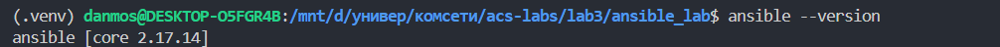

2. Создаём рабочую директорию и конфиг Ansible
```
mkdir -p ~/lab
cd ~/lab
```
`ansible.cfg:`:
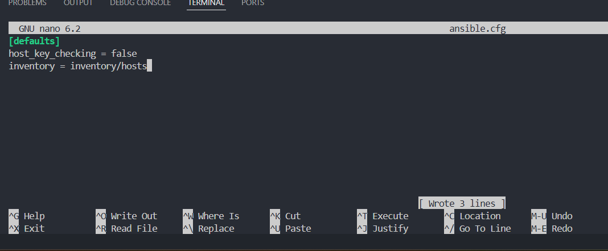

`inventory:`
```
mkdir -p inventory
cat > inventory/hosts <<'EOF'
[my_servers]
lab_server ansible_host=... ansible_user=root ansible_ssh_pass=...
EOF
```

3. Проверка подключения (ad-hoc)
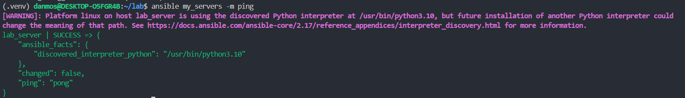

4. Пример создания и удаления файла
```
ansible my_servers -m shell -a "echo test_file_content > /root/test.txt"
```
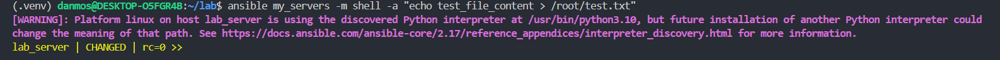<br>
Проверим
```
ansible my_servers -m shell -a "ls -l /root"
```
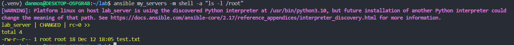<br>
Удалим
```
ansible my_servers -m file -a "path=/root/test.txt state=absent"
```
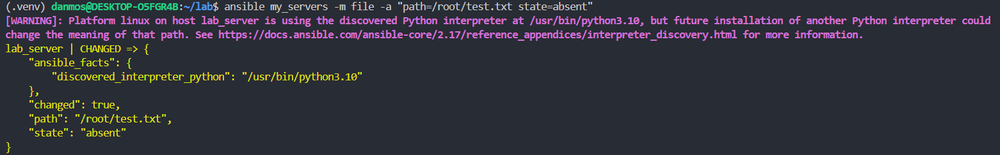


5. Задание 1. Переписать шаги create/modify/delete в playbook
`file_playbook.yml:`
```
---
- name: File lifecycle: create -> modify -> delete
  hosts: my_servers
  gather_facts: false
  tasks:
    - name: Create file with initial content
      copy:
        dest: /root/test.txt
        content: "initial_test_file_content\n"

    - name: Show file content (just for debug)
      command: cat /root/test.txt
      register: file_before
    - debug:
        msg: "Before change: {{ file_before.stdout }}"

    - name: Replace content with new value
      copy:
        dest: /root/test.txt
        content: "changed_content_by_ansible\n"

    - name: Show file content after change
      command: cat /root/test.txt
      register: file_after
    - debug:
        msg: "After change: {{ file_after.stdout }}"

    - name: Remove the file
      file:
        path: /root/test.txt
        state: absent
```
Проверим
```
ansible-playbook file_playbook.yml
```


### Часть 2. Установка Caddy через Ansible role / playbook
```
mkdir roles
cd roles
ansible-galaxy init caddy_deploy
```
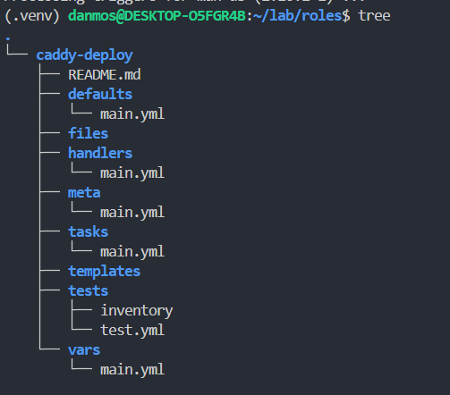<br>

`roles/caddy-deploy/tasks/main.yml`:
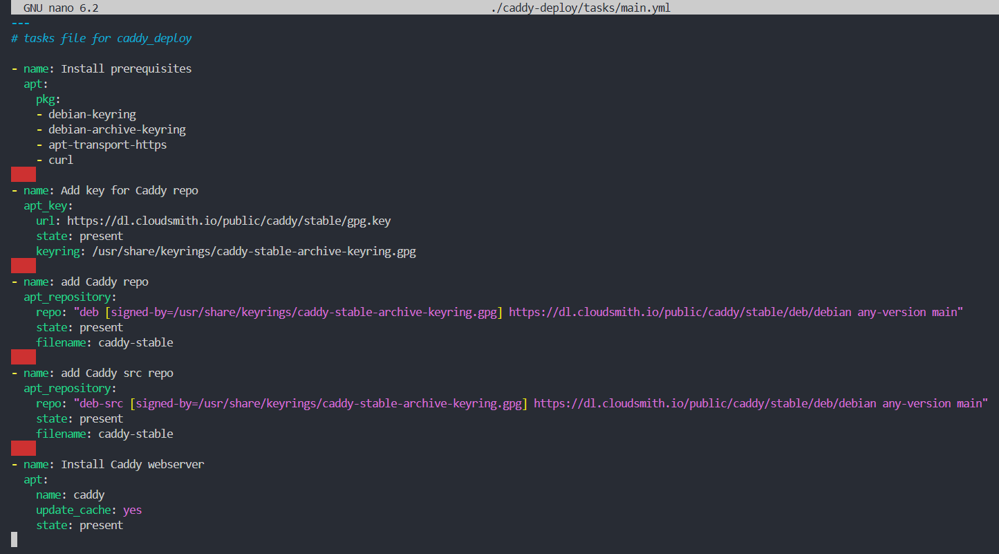<br>

`caddy_deploy.yml`:
```
---
- name: Install and configure Caddy webserver
  hosts: my_servers
  become: yes
  roles:
    - caddy-deploy
```
Проверим<br>
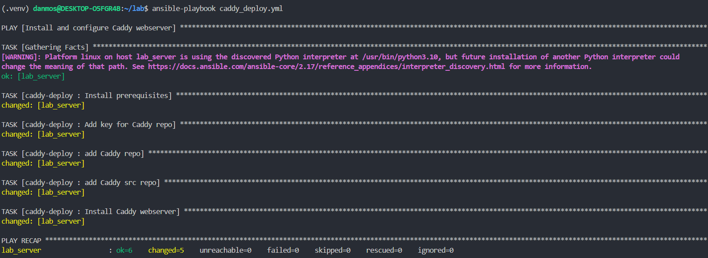<br>


### Часть 3. Привязка домена (duckdns) и TLS
1. Зарегистрируем домен на duckdns.org
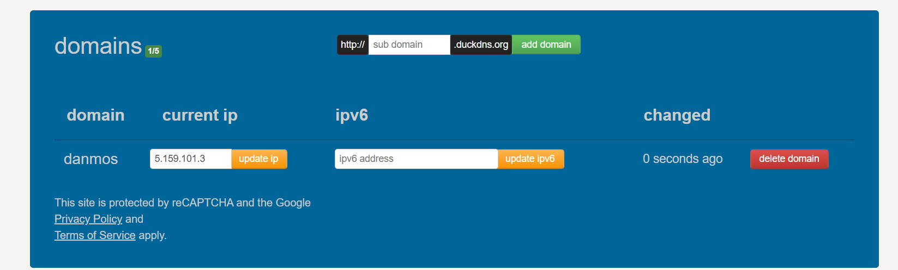<br>

2. Проверим
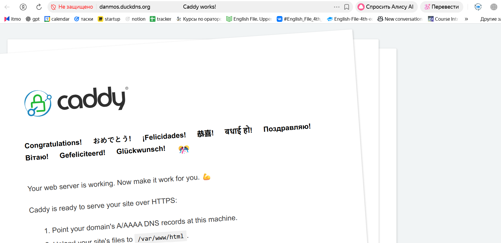<br>

3. Используем доп. возможности плейбуков:
`roles/caddy-deploy/templates/Caddyfile.j2:`
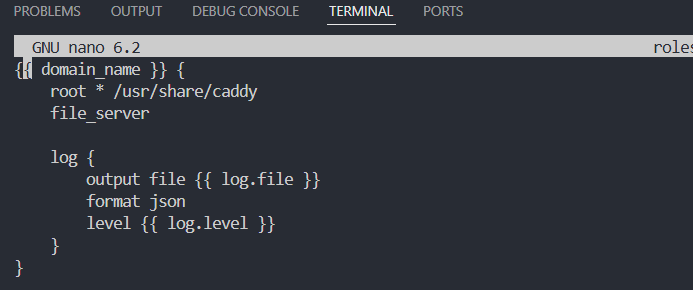

`roles/caddy-deploy/vars/main.yml:`
```
---

domain_name: danmos.duckdns.org

log:
  file: /var/log/caddy/access.log
  level: "INFO"
```
`roles/caddy-deploy/tasks/main.yml:`
```
...

- name: Create config file
  template:
    src: templates/Caddyfile.j2  # Откуда берем
    dest: /etc/caddy/Caddyfile  # Куда кладем
    
- name: Reload with new config
  service:
    name: caddy
    state: reloaded
```
4. Снова запускаем плейбук 
```
ansible-playbook caddy_deploy.yml
```
Проверим<br>
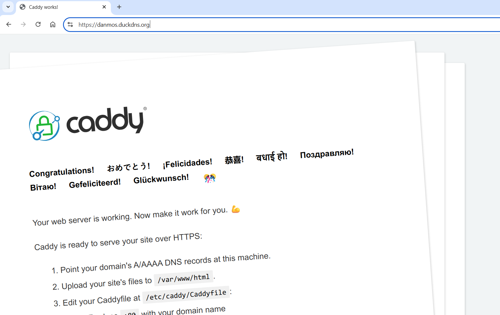

5. "Расширим"  конфиг вебсервера Caddy через заголовки headers
Для замены стандартной страницы Caddy была добавлена собственная статическая страница index.html:<br>
`roles/caddy-deploy/files/index.html:`
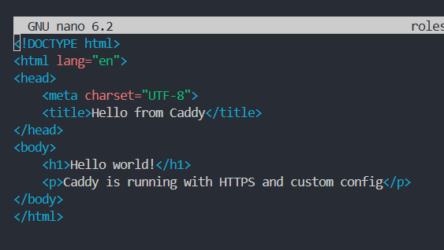<br>
Добавим HTTP-заголовки в конфигурацию Caddy::
`roles/caddy-deploy/templates/Caddyfile.j2:`
```
...

header {
        X-Content-Type-Options nosniff
        X-Frame-Options DENY
        X-XSS-Protection "1; mode=block"
    }
```
Добавим таск:<br>
`roles/caddy-deploy/tasks/main.yml:`
```
...

- name: Deploy index.html
  copy:
    src: index.html
    dest: /usr/share/caddy/index.html
    owner: caddy
    group: caddy
    mode: '0644'
```
Запустим и проверим: <br>
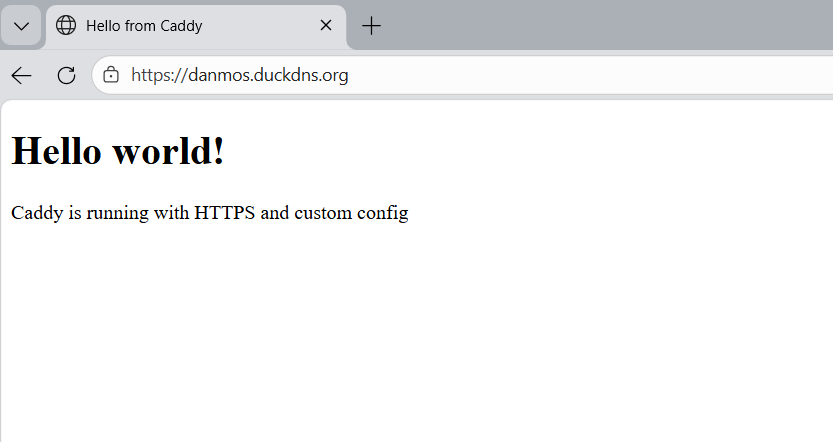<br>

## Вывод
В ходе лабораторной работы были освоены основы работы с системой управления конфигурациями Ansible, включая выполнение ad-hoc команд, написание playbook и использование ролей. С помощью Ansible был автоматизирован процесс установки и настройки веб-сервера Caddy, реализована генерация конфигурации с использованием шаблонов Jinja2 и переменных.

Также была выполнена привязка доменного имени с поддержкой HTTPS. Конфигурация веб-сервера была расширена добавлением HTTP-заголовков и собственной статической страницы. В результате был получен полностью автоматизированный и воспроизводимый процесс развёртывания веб-сервера.